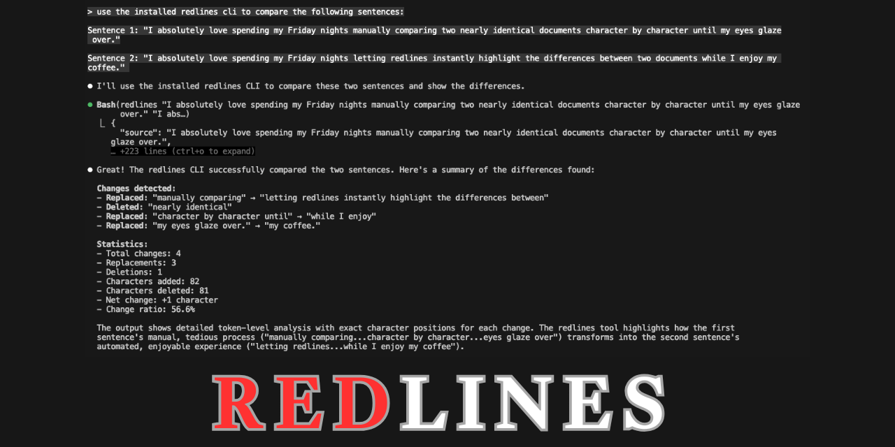

# Redlines



[](https://matrix.to/#/#redlines:matrix.esq.social)

`Redlines` produces a text showing the differences between two strings/text. The changes are represented with
strike-throughs and underlines, which looks similar to Microsoft Word's track changes. This method of showing changes is
more familiar to lawyers and is more compact for long series of characters.

Redlines uses [SequenceMatcher](https://docs.python.org/3/library/difflib.html#difflib.SequenceMatcher)
to find differences between words used.
The output can be in HTML, Markdown, or `rich` format.

## Example

Given an original string:

    The quick brown fox jumps over the lazy dog.

And the string to be tested with:

    The quick brown fox walks past the lazy dog.

The library gives a result of:

    The quick brown fox <del>jumps over </del><ins>walks past </ins>the lazy dog.

Which is rendered like this:

> The quick brown fox <del>jumps over </del><ins>walks past </ins>the lazy dog.

The library can also output the results in Markdown, HTML or `rich` format, and
for a variety of environments like Streamlit, Jupyter Notebooks, Google Colab and the terminal.

## Install

```shell
pip install redlines
```

## Usage

The library contains one class: `Redlines`, which is used to compare text.

```python
from redlines import Redlines

test = Redlines(
    "The quick brown fox jumps over the lazy dog.",
  "The quick brown fox walks past the lazy dog.", markdown_style="none",
)
assert (
        test.output_markdown
        == "The quick brown fox <del>jumps over </del><ins>walks past </ins>the lazy dog."
)
```

Alternatively, you can create Redline with the text to be tested, and compare several times to see the results.

```python
from redlines import Redlines

test = Redlines("The quick brown fox jumps over the lazy dog.", markdown_style="none")
assert (
        test.compare("The quick brown fox walks past the lazy dog.")
        == "The quick brown fox <del>jumps over </del><ins>walks past </ins>the lazy dog."
)

assert (
        test.compare("The quick brown fox jumps over the dog.")
        == "The quick brown fox jumps over the <del>lazy </del>dog."
)
```

Redlines also features a simple command line tool `redlines` to visualise the differences in text in the terminal.

```
 Usage: redlines text [OPTIONS] SOURCE TEST                                                                                                                                                                                                   
                                                                                                                                                                                                                                              
 Compares the strings SOURCE and TEST and produce a redline in the terminal. 
```

You may also want to check out the demo project [redlines-textual](https://github.com/houfu/redlines-textual).

## Documentation

[Read the available Documentation](https://houfu.github.io/redlines).

## Uses

* View and mark changes in legislation: [PLUS Explorer](https://houfu-plus-explorer.streamlit.app/)
* Visualise changes after ChatGPT transforms a
  text: [ChatGPT Prompt Engineering for Developers](https://www.deeplearning.ai/short-courses/chatgpt-prompt-engineering-for-developers/)
  Lesson 6

## License

MIT License

